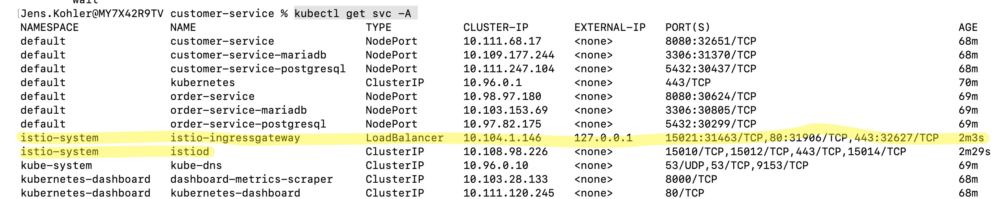

# Kubernetes Helm Tutorial

This repo shows a local installation of Kubernetes (minikube) and some example services. Service configurations are
provisioned with Helm.

## Kubernetes with minikube

### Install minikube

Install minikube from <https://kubernetes.io/de/docs/setup/minikube/>

### Install kubectl

Install kubectl from <https://kubernetes.io/de/docs/tasks/tools/install-kubectl/>

### Start minikube

Make sure that previous minikube stuff is deleted with
```cmd
minikube delete
```

Create a new minikube instance with:
```cmd
minikube start --cpus=8 --memory=10000 --driver=vmware
```

On Mac M1 platform we do not have this large amount of resources, so we must downstrip a bit
```cmd
minikube start --cpus=6 --memory=10000 --driver=docker
```

Note that there explicitly given a driver (vmware). The default is Docker, but on MacOS Docker cannot
establish a tunnel between minikube and the localhost (there is no bridge0 interface). This is not imporant 
for other operating systems. 


### (optional) Test your application on your local machine

Start a MariaDB Docker container

```cmd
docker run --name springboot-jpa-service-database -e MYSQL_ROOT_PASSWORD=jenskohler -p3306:3306 -d mariadb:latest
```

Populate some sample test data (normally the create table statement should not be necessary, as the table has
already been created by Springboot)

```sql
CREATE DATABASE demo;
USE demo;
CREATE TABLE customer (
  id varchar(255) PRIMARY KEY NOT NULL, 
  date_of_birth date, 
  first_name varchar(255), 
  last_name varchar(255)
);

    USE demo;
    INSERT INTO customer (id, date_of_birth, first_name, last_name) VALUES ('1', '2022-01-01', 'homer', 'simpson');
    INSERT INTO customer (id, date_of_birth, first_name, last_name) VALUES ('2', '2022-02-02', 'marge', 'simpson');
    INSERT INTO customer (id, date_of_birth, first_name, last_name) VALUES ('3', '2022-03-03', 'lisa', 'simpson');

```


Start the Springboot application locally, using the correct properties file: 

```cmd
java -jar -Dspring.profiles.active=local customer-service-0.0.1-SNAPSHOT.jar
java -jar -Dspring.profiles.active=local order-service-0.0.1-SNAPSHOT.jar
```

Test your local setup with accessing <http://localhost:8080/customers> (GET request). The previously inserted test data
should appear.

```
curl http://localhost:8080/customers
```

End your local application.


### (optional) Integrate mTLS into the services

To generate self-signed certificates use the commands below. 
The key pairs are generated into _server.p12_ and _client.p12_. 
We extract the public keys to _client.cer_ and _server.cer_ and import them into 
_client-truststore.p12_ and _server-truststore.p12_


Use Java's keytool to generate a key pair for the server. 

```
cd customer-service/src/main/resources
keytool -genkeypair -alias customer-service -keyalg RSA -keysize 4096 -validity 365 -dname "CN=Server,OU=Server,O=Examples,L=,S=CA,C=U" -keypass changeit -keystore customer-service-keystore.p12 -storeType PKCS12 -storepass changeit

cd order-service/src/main/resources
keytool -genkeypair -alias order-service -keyalg RSA -keysize 4096 -validity 365 -dname "CN=Server,OU=Server,O=Examples,L=,S=CA,C=U" -keypass changeit -keystore order-service-keystore.p12 -storeType PKCS12 -storepass changeit
```

Use Java's keytool to generate a key pair fo the client.

```
cd customer-service/src/main/resources
keytool -genkeypair -alias client -keyalg RSA -keysize 4096 -validity 365 -dname "CN=Client,OU=Server,O=Examples,L=,S=CA,C=U" -keypass changeit -keystore client.p12 -storeType PKCS12 -storepass changeit
```

Export public keys (generate certificate files)

```
keytool -exportcert -alias customer-service -file customer-service.cer -keystore customer-service-keystore.p12 -storepass changeit
keytool -exportcert -alias client -file client.cer -keystore client.p12 -storepass changeit

cd order-service/src/main/resources
keytool -exportcert -alias order-service -file order-service.cer -keystore order-service-keystore.p12 -storepass changeit
```

Import public keys into truststores

```
keytool -importcert -keystore customer-service-truststore.p12 -alias client-public -file client.cer -storepass changeit -noprompt
keytool -importcert -keystore customer-service-truststore.p12 -alias order-service-public -file ../../../../order-service/src/main/resources/order-service.cer -storepass changeit -noprompt
keytool -importcert -keystore client-truststore.p12 -alias customer-service-public -file customer-service.cer -storepass changeit -noprompt
keytool -importcert -keystore client-truststore.p12 -alias order-service-public -file ../../../../order-service/src/main/resources/order-service.cer -storepass changeit -noprompt

cd order-service/src/main/resources
keytool -importcert -keystore order-service-truststore.p12 -alias client-public -file ../../../../customer-service/src/main/resources/client.cer -storepass changeit -noprompt
keytool -importcert -keystore order-service-truststore.p12 -alias customer-service-public -file ../../../../customer-service/src/main/resources/customer-service.cer -storepass changeit -noprompt

```


Show content of truststore

```
keytool -list -keystore customer-service-truststore.p12
keytool -list -keystore order-service-truststore.p12
```

Activate TLS in _application.yml_ with the following properties

```
server:
  port: 8443
  ssl:
    key-store-type: PKCS12
    key-store: classpath:customer-service-keystore.p12
    key-store-password: changeit
    key-alias: customer-service
    client-auth: need
    trust-store: classpath:customer-service-truststore.p12
    trust-store-password: changeit
```

Alternatively, these properties can be passed as java arguments, so the jar must not be rebuilt:

```
java -jar -Dspring.profiles.active=local customer-service-0.0.1-SNAPSHOT.jar --server.ssl.key-store-type=PKCS12 --server.ssl.key-store=server.p12-server.port=8443
```

As soon as https is enabled, the services listen to the following ports: 

```
curl -k -v --cert-type P12 --cert client.p12:changeit https://localhost:8443/customers
curl -k -v --cert-type P12 --cert client.p12:changeit https://localhost:18443/orders
```

To use the self-signed certificates in Postman, these first have to be added


### Deploy service to Kubernetes

All commands of this section can be executed via Shell script:
```cmd
./run.sh
```

Build the sample _springboot-jpa-service_ with
```cmd
mvn clean install 
```

Deploy your application in a Docker container and provide it to minikube.

Access your minikube environment and let your Docker point to minikube:

```cmd
minikube docker-env

eval $(minikube -p minikube docker-env)
```

List your minikube Docker images:

```cmd
docker images
```

Build a Docker image from your application. Change in your project folder (springboot-jpa-service) and use:

```cmd
cd customer-service
docker build -t customer-service .

cd order-service
docker build -t order-service .
```

Verify that your image is present in the list of images

```cmd
docker images
```

## Helm

### (optional) Provision Mariadb as backend

The following steps are only required, if a new version of MariaDB should be 
integrated. As there is already a chart in the _customer-service/charts_ folder, 
these steps can be omitted. 

Add the Bitnami Helm repository to your list of Helm repositories: 
```cmd 
helm repo add bitnami https://charts.bitnami.com/bitnami
```

Pull the Mariadb image, which you would like to use, 
note that the latest release is pulled if nothing else is provided: 

```cmd 
helm pull bitnami/mariadb
```

Extract the downloaded tar.gz file:
```cmd 
tar -xvfz mariadb-10.4.2.tgz
```

Examine your downloaded and unzipped folders and adapt the values according to your needs.

### (optional) Install the Mariadb Helm chart:

Install the preconfigured MariaDB Helm chart:
```cmd
cd customer-service/charts/

helm install mariadb ./mariadb
```

Upgrade the Maridb Helm chart:
```cmd
helm upgrade -i mariadb ./mariadb
```

### Provision the customer service

Provision the service configuration with Helm:
```cmd
cd customer-service
helm install customer-service ./customer-service -f ./customer-service/values.yaml --dry-run --debug
helm install customer-service ./customer-service -f ./customer-service/values.yaml

cd order-service
helm install order-service ./order-service -f ./order-service/values.yaml --dry-run --debug
helm install order-service ./order-service -f ./order-service/values.yaml
```

Start the minikube dashboard with:
```cmd
minikube dashboard
```

It takes a while unitl all pods are green and running. Be patient!

An overview about the running services can be received with:
```cmd
kubectl get svc
```

To access the customer service create a tunnel from localhost to the k8s service
```cmd 
minikube service --url <SERVICE_NAME>
minikube service --url customer-service
```

The service should now be accessible via the URL and the Port that the previous command prints out.
If the service is not accessible (mostly caused by a minikube bug) the service can be tested inside the
pod the service runs in:

```cmd
curl http://localhost:8080/customers
```

Update only components, which have changed use the following Helm: 
```cmd
helm upgrade customer-service ./customer-service --reuse-values --set tracing.enabled=false
```

Remove the service:
```cmd
helm uninstall customer-service
```

## Istio with Minikube

Install Istio and add it to your path
```cmd
curl -L https://git.io/getLatestIstio | sh -
```

Extract the downloaded folder and put the _bin_ directory to your _PATH_
Check the installation with: 

```cmd
istioctl
```

Switch to your minikube environment and install Istio:

```cmd
minikube docker-env
eval $(minikube -p minikube docker-env)
istioctl install
```

After this, an _Istio LoadBalancer_ and an _Istio Service_ are created in the minikube cluster. 
Check this with:

```cmd
kubectl get svc -A
```

Note that Istio currently does not have a PublicIP. This can be fixed with:

```cmd
minikube docker-env
eval $(minikube -p minikube docker-env)
minikube tunnel
```

Now we have 2 Istio services running and the _ingress_ is accessible via _localhost_:




## Install Istio via Helm

```cmd
helm repo add istio https://istio-release.storage.googleapis.com/charts
helm repo update
```

Find your local Helm repository with:

```cmd
helm env
```

For instance, on a Mac the repository location is

```cmd
/Users/<USER_NAME>/Library/Caches/helm
```

Create a namespace istio-system for Istio components:

```cmd
kubectl create namespace istio-system
```

Install Istio base chart which contains cluster-wide resources used by the Istio control plane:

```cmd
helm install istio-base istio/base -n istio-system
```

Install Istio discovery chart which deploys the istiod service:

```cmd
helm install istiod istio/istiod -n istio-system --wait
```

Install an Istio ingress gateway:

```cmd
kubectl create namespace istio-ingress
kubectl label namespace istio-ingress istio-injection=enabled
helm install istio-ingress istio/gateway -n istio-ingress --wait
```

Create a tunnel to access Istio ingress:

```cmd
minikube tunnel
```